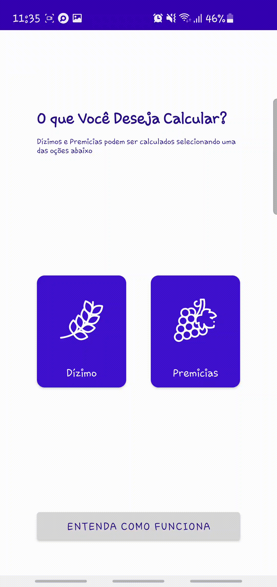
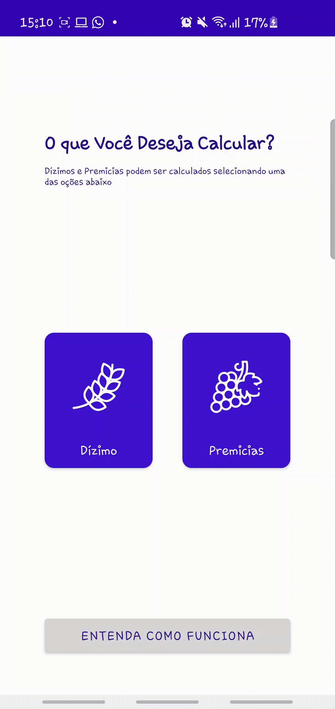
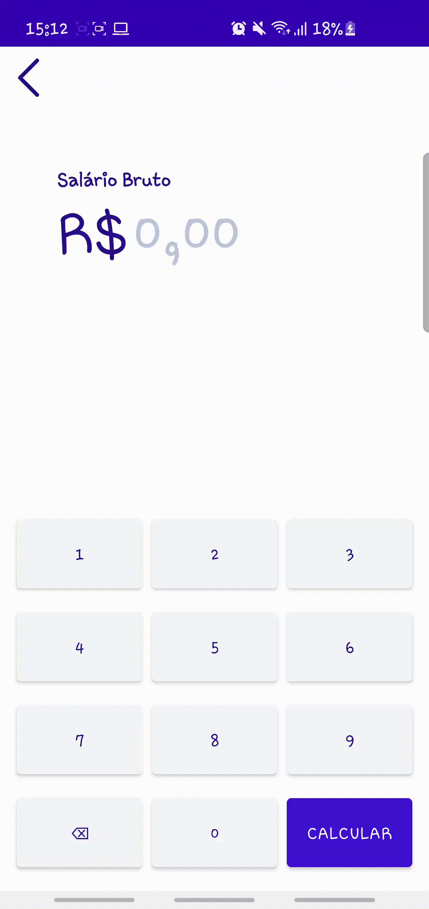

# App-Dizimo-e-Premicias

## Diretório Original

## Resumo
Aplativo feito para calculos de Dizimos e Primicias 

## Informações Técnicas 
- Linguagem Kotlin
- Uso de Constraint Layout no Xml
- Uso de RadioGroups
- Construção de Teclado númerico usando CustomView

## Desenvolvimento do Projeto

A primeira tela do app é a tela inicial que direcionará o usuário para a cálculadora de dizimos, de premicias ou as informações sobre o funcionamento do App.

Ao selecionar o evento "Dizimo" o usuário entra na aba para escolher algumas informações como porcentagem do dizimo, calculo considerando os meses como trinta dias, etc.

Após o usuário marcar suas preferências é levado a calculadora onde entrará com os dados do salário bruto

